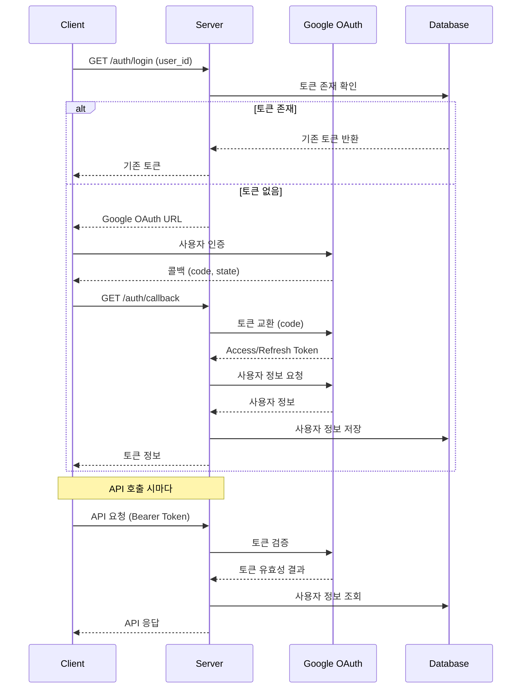

# 구글 OAuth2 로그인 시스템

## 개요
이 프로젝트는 구글 OAuth2를 사용하여 사용자 인증을 처리합니다. 자체 JWT 토큰 대신 구글의 Access Token을 직접 사용하여 API 인증을 수행합니다.

## 인증 흐름 (Flow)

### 1. 로그인 URL 요청
```
GET /api/v1/auth/login
Body: { "user_id": "사용자ID" }
```

**처리 과정:**
1. 클라이언트가 사용자 ID와 함께 로그인 URL 요청
2. 서버가 DB에서 해당 사용자의 토큰 존재 여부 확인
3. **토큰이 있는 경우**: 기존 토큰 반환
4. **토큰이 없는 경우**: 구글 OAuth URL 생성하여 반환

**응답:**
```json
{
    "login_url": "https://accounts.google.com/oauth/authorize?...",
    "state": "csrf-protection-token"
}
```

### 2. 구글 OAuth 인증
사용자가 구글 로그인 페이지에서 인증을 완료하면, 구글이 콜백 URL로 리다이렉트합니다.

### 3. OAuth 콜백 처리
```
GET /api/v1/auth/callback?code=AUTHORIZATION_CODE&state=STATE
```

**처리 과정:**
1. Authorization Code를 구글 토큰 서버로 전송
2. 구글로부터 Access Token과 Refresh Token 수신
3. Access Token으로 구글 사용자 정보 조회
4. 사용자 정보를 DB에 저장 (신규 사용자의 경우 자동 등록)
5. 토큰 정보 클라이언트에 반환

**응답:**
```json
{
    "access_token": "ya29.a0AfH6SMC...",
    "token_type": "Bearer",
    "expires_in": 3600,
    "expires_at": "2024-01-01T12:00:00Z",
    "refresh_token": "1//04...",
    "scope": "openid email profile"
}
```

### 4. API 호출 인증
모든 보호된 API 엔드포인트는 구글 Access Token을 사용합니다.

**요청 헤더:**
```
Authorization: Bearer ya29.a0AfH6SMC...
```

**검증 과정:**
1. Authorization 헤더에서 토큰 추출
2. 구글 토큰 검증 API로 토큰 유효성 확인
3. 토큰이 유효하면 사용자 정보 추출
4. DB에서 사용자 정보 조회/업데이트
5. 요청 처리 진행

### 5. 토큰 갱신
Access Token이 만료되면 Refresh Token으로 새 토큰을 발급받습니다.

```
POST /api/v1/auth/token/refresh
Body: { "refresh_token": "1//04..." }
```

**응답:**
```json
{
    "access_token": "ya29.a0AfH6SMC...",
    "token_type": "Bearer",
    "expires_in": 3600,
    "expires_at": "2024-01-01T13:00:00Z",
    "refresh_token": "1//04...",
    "scope": "openid email profile"
}
```

## 시퀀스 다이어그램



## 주요 컴포넌트

### 1. 인증 라우터 (`auth_router.py`)
- `/login`: 로그인 URL 생성
- `/callback`: OAuth 콜백 처리
- `/verify`: 토큰 검증
- `/token/refresh`: 토큰 갱신

### 2. 구글 OAuth 모듈 (`google_oauth.py`)
- `get_google_login_url()`: 구글 로그인 URL 생성
- `exchange_code_for_token()`: Authorization Code를 토큰으로 교환
- `get_user_info()`: Access Token으로 사용자 정보 조회
- `verify_google_token()`: 토큰 유효성 검증
- `refresh_google_token()`: 토큰 갱신

### 3. 사용자 레포지토리 (`repositories.py`)
- 사용자 정보 CRUD 작업
- 토큰 정보 저장/조회

## 환경 설정

`.env` 파일에 다음 설정이 필요합니다:

```env
# Google OAuth2 설정
GOOGLE_CLIENT_ID=your-client-id.googleusercontent.com
GOOGLE_CLIENT_SECRET=your-client-secret
GOOGLE_REDIRECT_URI=http://localhost:8000/api/v1/auth/callback

# MongoDB 설정
MONGODB_URL=mongodb://localhost:27017
DATABASE_NAME=backend_db
```

## 보안 고려사항

1. **CSRF 보호**: `state` 매개변수로 CSRF 공격 방지
2. **토큰 저장**: Refresh Token은 안전하게 DB에 저장
3. **HTTPS 필수**: 프로덕션 환경에서는 반드시 HTTPS 사용
4. **토큰 만료**: Access Token은 1시간 후 자동 만료
5. **스코프 제한**: 필요한 최소한의 권한만 요청

## 에러 처리

### 일반적인 에러 상황
- **토큰 만료**: 401 에러와 함께 토큰 갱신 안내
- **잘못된 토큰**: 401 에러와 함께 재인증 요구
- **네트워크 오류**: 503 에러와 함께 재시도 안내
- **사용자 정보 없음**: 404 에러와 함께 등록 안내

### 클라이언트 측 처리 권장사항
1. 토큰 만료 시간(`expires_at`) 모니터링
2. API 호출 실패 시 토큰 갱신 시도
3. 갱신 실패 시 재로그인 플로우 시작

## API 엔드포인트 요약

| 엔드포인트 | 메서드 | 설명 |
|-----------|--------|------|
| `/auth/login` | GET | 로그인 URL 요청 |
| `/auth/callback` | GET | OAuth 콜백 처리 |
| `/auth/verify` | POST | 토큰 검증 |
| `/auth/token/refresh` | POST | 토큰 갱신 |

모든 보호된 API는 `Authorization: Bearer {access_token}` 헤더가 필요합니다. 